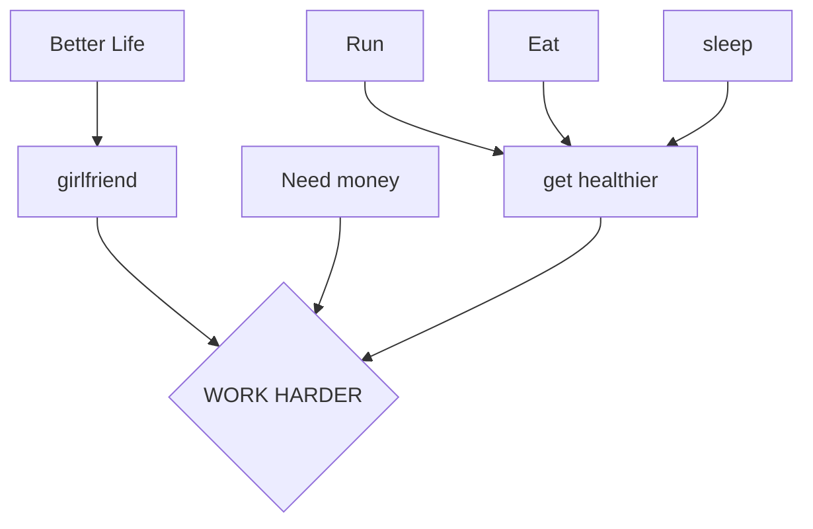

[[Jul 4th, 2023]]

project:: logseq

{{renderer :tocgen2}}

# ☕️ Conclusion

[[Jul 5th, 2023]] 01:01

  + 虽然一天下来学习的蛮累，但却是非常喜欢这款软件

  + 要比notion更加的快，可以同时显示两个画面，复盘的时候很方便

  + 而且可以直接绑定chatgpt这一点超级好

  + 过几天再来做一个跟进

[[Aug 19th, 2023]]

  + 研究这一个多月,改变工作习惯超级多,生成了超级多了笔记

  + 还入坑了vim, 发现原来这种高效笔记的社区已经存在了十几年, vimwiki 就是这个例子

  + 还因为logseq 学会了github的使用,包括github pages 搭建网站

  + 整个工作学习流程都巨变了, 过程大概是,由logseq启发了vim, 在发现快捷键可以带来的高效率,后来在研究了raycast, 开始减少鼠标(分心)的使用,再到vimwiki, 知识总结时间管理的能力大大提示

  + 比如每天待办事项就会在journal 中写好, todo 自带了计时器, 然后就开始专研

尤其是枯燥但是想做的任务,打开计时器就像当作时间挑战一样, 比如encyclopedia 目录的整理,用了2-3小时完全解决. 大大加速了学习效率. 还有那个之前的中文书格式问题, 用vim 的join lines 功能一晚上就解决完了.

## 🧐issues

  + 

  + 

##

## **🩸Logseq缺点**：

    + ❗️这也可能是我需要改进提升的地方

    + [sync logseq](https://blog.logseq.com/how-to-setup-and-use-logseq-sync/)

  + 

## **💪Logseq好处：**

  + 加入时间戳方便

  + 速度要比apple notes 快， apple notes更适合处理flee note

  + 笔记可以很好的进行迁移 **同时同步的问题也痛苦**

  + 数据可以是文本形式，可以结合chatgpt retrieval处理数据

  + 

  + 

  + 

## 😍吸引我的地方**

  + 支持这种的流水式笔记

  + 让我有写代码的感觉，可以让思路边细腻

  + 支持youtube的时间戳笔记。**之前我要靠youtube评论才能做到这一点**

  + 免费

  + 非常是和处理复杂的问题

## **🍎现在的方案 apple note**

  + **优点**

    + 不是和我的流水笔记

  + **缺点**

    + 处理复杂项目的时候会很混乱

    + 

  + 

  + 

## **我的生活需要优化的地方**

  + 减少工作时间

  + 增加效率

    + 解决因为学习太多之后希望老跟人说的问。 **我需要内化处理好这些资讯**

**19:38 对比obisidian**

  + O的iCloud同步非常方便

  + 但是

{{video https://www.youtube.com/watch?v=RtZWVoTWv74}}

笔记

  + @00:07:00[[paragraph vs outliner]]

  + @00:08:04 chronology

  + @00:09:13 凑合，导出时可以调节去掉额外的标记

  + 

**能够支持Mermaid**

  + 

  + 
{{renderer :mermaid_cahglv}}

